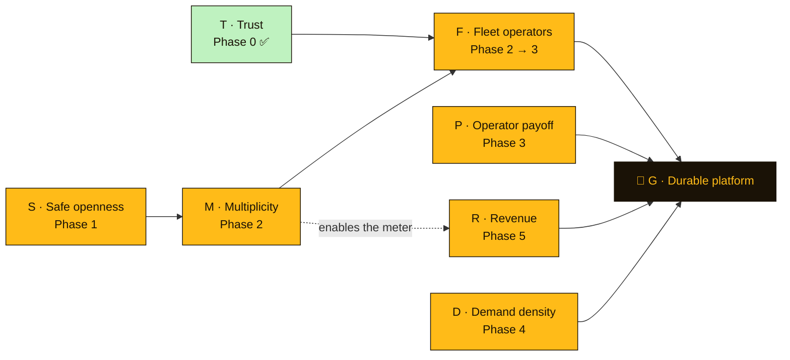

# Lunch a Go-Go — Roadmap

### *A calculus of necessary and sufficient conditions*

This is not a wish list. It is a **proof sketch**. Every phase below exists because
some condition is *necessary* for the thing we actually want, and the phase is the
work that makes that condition true. Read it as one long chain of **if A then B,
because A implies B** — and, just as importantly, its contrapositive: **without A,
never B.**

The load-bearing claim of the whole document:

> **Multi-truck-per-account is necessary for the goal.** Not because it is elegant —
> because fleet operators are a necessary condition for a durable platform, and
> multi-truck is a necessary condition for fleet operators. Remove either link and
> the goal becomes unreachable, no matter what else we build.

---

## 0. Grammar of this document

We write implications with `⟹`.

- **`A ⟹ B`** means *A is **sufficient** for B* — having A guarantees B.
- The **same statement** means *B is **necessary** for A* — you cannot have A without B.
  (Equivalently, the contrapositive `¬B ⟹ ¬A`: lose B and you lose A.)

So one arrow carries both readings. When we say "**X is necessary for Y**," we are
asserting `Y ⟹ X`. When we say "**X is sufficient for Y**," we are asserting `X ⟹ Y`.
Most of this roadmap is about **necessary** conditions, because necessary conditions
are the ones that *force* work: you cannot route around them.

Every implication is tagged:

- **[THEOREM]** — forced by definitions or by the current code. Not a matter of opinion;
  you can point at the line that makes it true.
- **[AXIOM]** — a strategic **bet**. It could be wrong. Each axiom therefore ships with a
  **falsifier**: the observation that would disprove it and let us delete the work it
  justifies.

A roadmap built on bets should say how it would learn it was wrong. That's what the
falsifiers are for.

---

## 1. The propositions

The entire plan is written in terms of eight propositions. Each is either **true now**
or **something a phase makes true**.

| Sym | Proposition | State |
| --- | --- | --- |
| **T** | **Trust** — auth is hardened and every UI invariant is DB-enforced (no impersonation, no location leak, no unbounded queries). | ✅ **true** (Phase 0) |
| **S** | **Safe openness** — truck creation is abuse-**bounded** *without* a hard one-per-owner lock. | ❌ false |
| **M** | **Multiplicity** — one account can own and operate **many** trucks (data model + switcher UI), each still ownership-scoped. | ❌ false |
| **F** | **Fleet operators** are onboarded and retained as users. | ❌ impossible today |
| **P** | **Payoff** — per-truck patron analytics good enough that an operator *wants* to stay. | ❌ partial |
| **D** | **Demand density** — enough foodies per area that being listed materially matters. | ❌ not yet |
| **R** | **Revenue** — operators pay, metered naturally per truck. | ❌ not yet |
| **G** | **Goal** — Lunch a Go-Go is the durable, sticky **operations layer for the local food-truck economy** (a business, not a hobby). | 🎯 target |

---

## 2. The canon (the implications everything hangs on)

These are the axioms and theorems. Everything in §4 is just *making their antecedents
true, in dependency order.*

### A1 — The goal needs fleets. `G ⟹ F` **[AXIOM]**
A durable platform requires fleet/commissary operators as users. They carry budget,
generate the most locations and content, and churn least; a base made purely of
single-truck hobbyists does not compound into a business.
**∴ F is necessary for G.**
**Falsifier:** if, over 2–3 quarters, single-truck operators alone deliver target
retention *and* willingness-to-pay, A1 is false — and Phase 2 can be demoted.

### T2 — Fleets need multiplicity. `F ⟹ M` **[THEOREM]**
A fleet operator runs more than one truck **by definition**. Today the app pins exactly
one truck per account in two places:
- `app/src/routes/truck/+layout.ts` loads trucks `.eq('owner_id', user.id).limit(1)` and
  returns `trucks[0]` — the entire dashboard is built around *your one truck*;
- `0003_security_hardening.sql` adds `constraint trucks_owner_unique unique (owner_id)`.

So a fleet operator **cannot represent their business** without M. This is not a
preference; it's the current schema and loader.
**∴ M is necessary for F.** (Contrapositive `¬M ⟹ ¬F`: no multiplicity, no fleet users —
they'd have to fragment across logins, which is not "a fleet operator as a user" in any
retained sense.)

### T3 — Multiplicity needs a new bound. `M ⟹ S` **[THEOREM]**
Shipping M means dropping `trucks_owner_unique`. That reopens the abuse vector the
constraint closed (Seb #5: one account minting unlimited fake trucks). So M is only
*shippable* alongside a replacement bound.
**∴ S is necessary for (a safe) M.**

### T4 — Metered revenue needs multiplicity. `R_meter ⟹ M` **[THEOREM]**
The natural way to charge operators is **per truck**. "Per truck" is only a meaningful
meter if an account can hold many trucks; with a hard one-per-owner lock, per-truck and
per-account are the same number and there is nothing to meter.
**∴ M is necessary for per-truck revenue** — the same M we already needed for F pulls
double duty here.

### A5 — Retention needs payoff. `F_retained ⟹ P` **[AXIOM]**
M gets an operator *in the door*; it does not keep them. An operator stays only if the
app pays them back — chiefly the "who's a good investment" patron analytics
(the `get_truck_patrons` RPC is the seed).
**∴ P is necessary for durable F.**
**Falsifier:** if operators retain on location/menu tools alone without ever opening
analytics, P is not necessary and Phase 3 can shrink.

### T6 — Operators need an audience. `F ⟹ D` **[THEOREM, two-sided market]**
An operator broadcasting to zero foodies gets zero value; a marketplace needs both sides.
**∴ D is necessary for durable F** (and the reciprocal holds too — operators seed the
content that attracts foodies — which is *why* the loop is worth building, not a
contradiction).

### A7 — Durability needs revenue. `G ⟹ R` **[AXIOM]**
"Durable" means it sustains itself. On a tight budget with per-user infra cost, that
means income.
**∴ R is necessary for G.**
**Falsifier:** if the platform is durably sustained another way (sponsorship, grants,
foodie-side monetization), operator revenue is not necessary and Phase 5 changes shape.

### T0 — Adoption needs trust. `adoption ⟹ T` **[THEOREM]**
No serious operator or foodie adopts an app that can be impersonated or that leaks their
location. **∴ T is necessary for F.** — and **T is already true** (Phase 0). We open the
proof having discharged one necessary condition; the rest of the roadmap discharges the
others.

---

## 3. Assemble the proof — why this roadmap is *forced*

Chain the necessary conditions by transitivity:

```
G ⟹ F        (A1: goal needs fleets)
  ⟹ M        (T2: fleets need multiplicity)
  ⟹ S        (T3: multiplicity needs a safe bound)

∴  G ⟹ M   and   G ⟹ S
```

Read plainly: **multiplicity and a safe-openness bound are necessary for the goal.**
They are the two conditions that are *false right now*, sitting on the critical path,
with nothing else able to substitute for them.

And the **contrapositive** — the reason not to skip them:

```
¬S ⟹ ¬M ⟹ ¬F ⟹ ¬G
```

> Keep today's hard one-truck-per-owner lock, and the goal is **unreachable** — not
> harder, *unreachable* — because you have foreclosed the only class of user (A1 says)
> the goal requires.

Because you can only *make* a necessary condition true after its own prerequisites are
true, the **construction order is the chain read backwards**: satisfy the deepest
prerequisite first.

```
S  →  M  →  F  →  {P, D, R}  →  G
```



> **Reading the arrows:** `X → Y` means "**X is necessary for Y**" (equivalently
> `Y ⟹ X`) — the tail is a prerequisite of the head. Necessity points rightward toward
> the goal; construction proceeds left-to-right, satisfying prerequisites first.

---

## 4. The phases (each phase = making one necessary condition true)

### Phase 0 — Foundation & trust — **satisfies T** ✅ *done*

The MVP plus the `0003` hardening pass. Auth is Supabase GoTrue (not hand-rolled);
Row-Level Security guards every table; and the DB now enforces the invariants the UI used
to trust (`tg_checkin_guard` sets identity from `auth.uid()` and fuzzes coordinates;
`nearby_trucks` clamps its inputs; public location reads are limited to live + upcoming).

**Discharges:** `adoption ⟹ T` (T0).
**A necessary-vs-sufficient lesson, paid forward:** to bound truck-spam quickly, `0003`
chose `UNIQUE(owner_id)`. Note precisely what that is:

- `UNIQUE(owner_id) ⟹ bounded-abuse` — **sufficient** ✅ (one truck max is certainly bounded), *and*
- `UNIQUE(owner_id) ⟹ ¬M` — it also **forecloses multiplicity** ❌.

The lock was a **sufficient** condition for safety that was **not necessary** for it — and
it happened to kill M. That is the debt Phase 1 repays: swap it for a bound that is *also*
sufficient for safety but *compatible* with M. **Choosing a non-necessary sufficient
condition that forecloses a future necessary one is exactly the mistake this document
exists to prevent.**

**Exit criterion (already met):** impersonation, precise-location leak, unbounded
`nearby_trucks`, and duplicate-owner spam are all impossible against the raw API, not just
the UI.

---

### Phase 1 — Safe openness — **satisfies S** — *unblocks everything*

**Because `M ⟹ S` (T3):** we cannot open multiplicity until abuse is bounded *without* the
hard lock.

- Migration `0004_soft_truck_cap.sql` (run on the one shared DB, mirrored in both branches):
  - `DROP CONSTRAINT trucks_owner_unique;`
  - Add `tg_truck_cap()` — a `BEFORE INSERT` trigger that counts an owner's existing trucks
    and raises if it would exceed a cap (start at **5**; one constant to change later).
  - Keep **Confirm email** ON so an account costs a verified inbox.
- App: make the "you already have a truck" dead-end into an *"Add another truck"* affordance
  (up to the cap), and turn the cap breach into a friendly message, not a raw Postgres error.

**S is now: `soft-cap ∧ confirmed-email`.** Check that `soft-cap ⟹ bounded-abuse`
(sufficient) **and** that `S ∧ M` is satisfiable (compatible) — the two properties the old
lock could not hold at once.

**Exit criterion (S becomes true):** an owner can create trucks #2…#5; truck #6 is refused
gracefully; no unbounded creation exists via the direct API.

---

### Phase 2 — Multiplicity — **satisfies M** — *the crux*

**Because `F ⟹ M` (T2):** this is the necessary condition for fleet operators, and the one
the whole document is named after. The schema already supports it (`trucks.owner_id` is a
one-to-many FK); today's `.limit(1)` and the (now-dropped) unique lock were the only
obstacles.

- **Layout:** in `app/src/routes/truck/+layout.ts` drop `.limit(1)`, load *all* of the
  owner's trucks, and expose `{ trucks, selectedTruck }`.
- **Selection state:** `?truck=<id>` (shareable/deep-linkable) with a `localStorage`
  fallback (`lag:selected-truck`); default to the first truck.
- **Switcher:** a **"Managing: Taco Truck ▾"** control in the truck-dashboard header —
  pick a truck, or **"+ Add another truck."**
- **Downstream pages inherit for free:** location, menu, specials, hours, schedule, and
  patrons already operate on the layout's truck; point them at `selectedTruck` and they
  need almost nothing else.
- **Authorization is untouched:** M widens *ownership count*, never *ownership scope*.
  Every truck is still guarded by `owns_truck` / RLS. Formally: `M ⟹ ¬(weaker authz)` —
  worth asserting so no one "simplifies" the guard later.
- **Mirror to Option A** (`claude/lunchagogo-webapp-bilao2`) via its server loaders.

**Exit criterion (M becomes true):** one account operates ≥2 trucks; switching the active
truck re-keys every management page; each truck remains owner-scoped. **At this instant
`¬F` stops being forced** — fleet operators become *possible* users.

> **Necessary, not sufficient.** M removes the blocker; it does not summon fleets. `F` is
> realized by `M ∧ P ∧ D ∧ outreach`. Phases 3–5 supply the rest.

---

### Phase 3 — Operator payoff — **satisfies P** — *turns possible-F into retained-F*

**Because `F_retained ⟹ P` (A5).** Build on `get_truck_patrons`: repeat-visit counts,
recency, a per-truck "good investment" view, and — now that one owner sees many trucks —
**cross-truck** patron rollups a single-truck account could never show. Multiplicity makes
the analytics *more* valuable, tightening the loop: `M` doesn't just enable `F`, it
sweetens `P`.

**Exit criterion (P):** an operator can name their best patrons per truck and across their
fleet, and returns to that view unprompted.

---

### Phase 4 — Demand density — **satisfies D** — *the other side of the market*

**Because `F ⟹ D` (T6).** Grow foodies where trucks are: share links on every truck and
check-in, truck-initiated "tell your followers," and the push loop (`notify` Edge Function
+ Web Push, already built) as the re-engagement engine. No algorithm — chronological, per
the product's spine.

**Exit criterion (D):** in at least one metro, a truck going live reliably reaches a
non-trivial nearby foodie audience.

---

### Phase 5 — Revenue — **satisfies R** — *closes the loop to G*

**Because `G ⟹ R` (A7) and `R_meter ⟹ M` (T4).** Meter **per truck** — the meter Phase 2
made possible. A single-truck owner-operator can stay free or cheap; a fleet pays in
proportion to the trucks it runs, which is exactly the operator segment A1 says the goal
depends on. The revenue model and the necessary-user segment are the *same set*.

**Exit criterion (R):** fleet operators pay per active truck without the pricing pushing
them back into the multi-account fragmentation Phase 2 abolished.

---

## 5. Current-state evaluation (run the proof against reality)

| Condition | Necessary for | Now | Because |
| --- | --- | --- | --- |
| **T** Trust | F, adoption | ✅ true | Phase 0 / `0003` |
| **S** Safe openness | M | ❌ false | `0003` shipped the *hard* lock, not a soft bound |
| **M** Multiplicity | F, R_meter | ❌ false | `truck/+layout.ts:16` `.limit(1)`; `trucks_owner_unique` |
| **F** Fleet operators | G | ❌ **impossible** | forced by `¬M` via T2 |
| **P** Payoff | retained F | ◐ partial | `get_truck_patrons` exists; not yet a retention surface |
| **D** Demand density | retained F, G | ❌ not yet | pre-launch |
| **R** Revenue | G | ❌ not yet | needs the per-truck meter M unlocks |
| **G** Goal | — | 🎯 | reachable **iff** the column above is driven to all-✅ |

**The one-line diagnosis:** `S` and `M` are false, `M` is necessary for `F`, and `F` is
necessary for `G` — so today the goal is not merely distant, it is **logically blocked**
at the multiplicity link. Phases 1–2 are the minimum edit that unblocks it.

---

## 6. Invariants (theorems that must survive every future change)

These are `⟹` relationships that later work is forbidden to break. Treat a PR that
violates one as a proof error.

1. **`checkin ⟹ identity = auth.uid()`** — a post's author is the DB's, never the client's.
2. **`read(truck-data) ⟹ owns_truck ∨ public-safe`** — access is by *ownership*, never by
   the `role` flag (role is a UI mode, not a privilege boundary).
3. **`M ⟹ ¬(weaker authz)`** — many trucks per owner never means looser per-truck guards.
4. **`create-truck ⟹ bounded`** — some bound (soft cap) always holds; openness is never
   *un*bounded, even after the hard lock is gone.
5. **`feed ⟹ chronological`** — no ranking algorithm, ever. Ordering is time, by design.

---

## 7. How to extend this document

When proposing a feature, do not argue that it is *good*. Argue one of:

- **"It is necessary for `X`"** — state the implication `X ⟹ feature`, tag it THEOREM or
  AXIOM, and (if AXIOM) give its falsifier; **or**
- **"It is sufficient to unblock `Y`"** — state `feature ⟹ Y` and show `Y` is on the path to
  `G`.

If a feature is neither necessary for something we need nor sufficient to unblock
something we need, it is not on this roadmap yet — no matter how good it is. That is the
whole discipline: **if A then B, because A implies B.**
